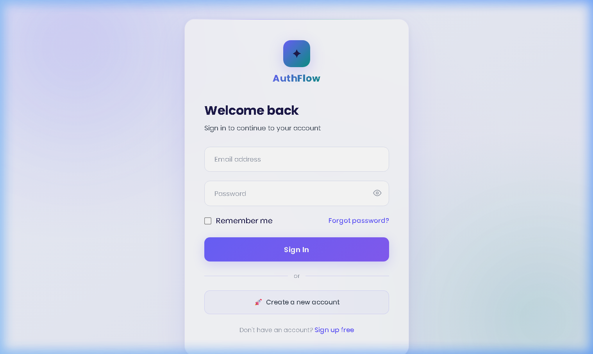
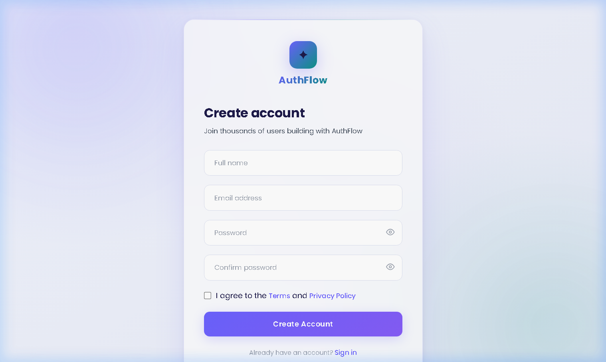
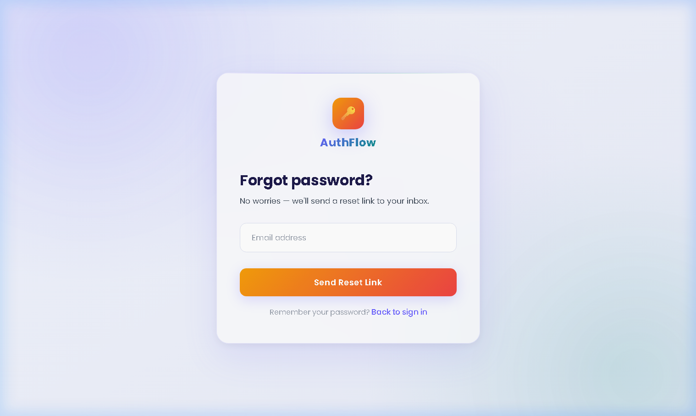
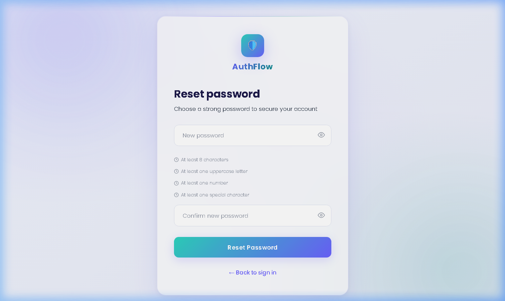
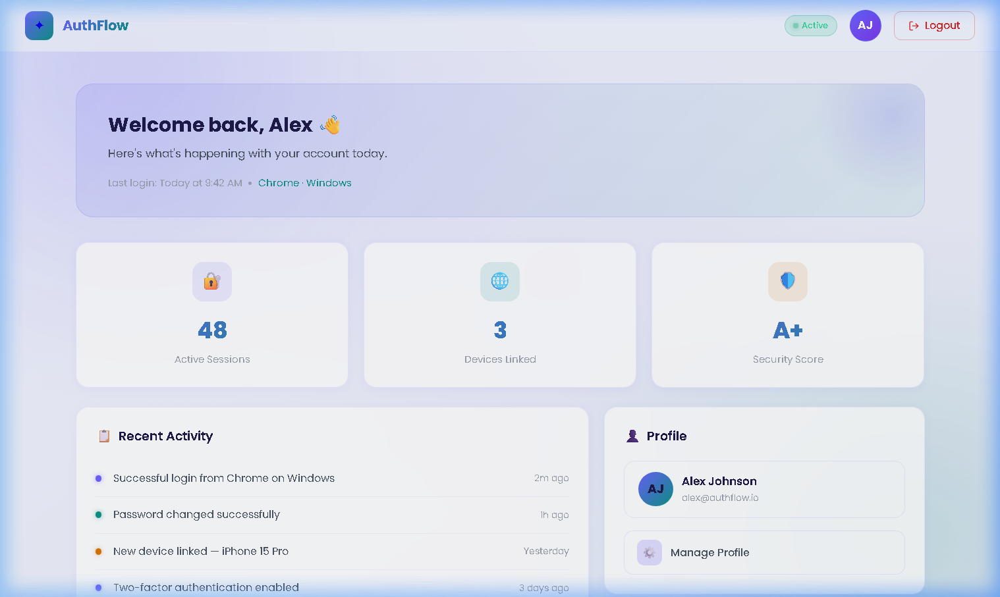

# AuthFlow — Authentication System UI

A visually stunning, modern **Authentication System UI** built with **HTML5**, **Bootstrap 5**, and **custom CSS**. Designed with a premium light theme, glassmorphism effects, smooth micro-interactions, and full responsiveness across all devices.

---

## 🚀 Live Pages

| Page | File |
|---|---|
| 🔑 Login | `index.html` |
| 📝 Register | `register.html` |
| 📬 Forgot Password | `forgot-password.html` |
| 🛡️ Reset Password | `reset-password.html` |
| 🖥️ Dashboard | `dashboard.html` |

---

## 📸 Screenshots

### 1. Login Page


### 2. Register Page


### 3. Forgot Password Page


### 4. Reset Password Page


### 5. Dashboard Page


---

## ✨ Features

### Design System
- **Premium Light Theme** — soft lavender/white gradient background with violet and teal accents
- **Glassmorphism** — frosted glass cards using `backdrop-filter: blur(24px)` with semi-transparent backgrounds
- **Google Fonts** — Poppins (300–800 weight) for modern, clean typography
- **Consistent Color Palette** — `#6c63ff` primary violet · `#0d9488` teal · `#1e1b4b` deep text
- **Smooth Transitions** — `cubic-bezier(0.4, 0, 0.2, 1)` on all interactive elements

### Login Page (`index.html`)
- Centered glassmorphic card with animated entry
- Floating labels for email and password inputs
- Password show/hide toggle with SVG icon
- Gradient **Sign In** button with ripple click effect
- "Remember me" checkbox and "Forgot password?" link
- Animated loading dots on form submit → redirects to dashboard

### Register Page (`register.html`)
- Fields: Full Name, Email, Password, Confirm Password
- **Live password strength meter** — 4 levels (Weak / Fair / Good / Strong) with color-coded bar
- **Real-time password match hint** — appears as you type confirm field
- Dual password show/hide toggles
- Terms & Privacy Policy checkbox

### Forgot Password Page (`forgot-password.html`)
- Minimal single-input form with warm orange-red gradient button
- **Animated success state** — card transitions to a "Check your inbox 📬" message after submit
- Resend email button to return to the form

### Reset Password Page (`reset-password.html`)
- Two password fields with individual show/hide toggles
- **4 live validation hints** that turn green as requirements are met:
  - ✅ At least 8 characters
  - ✅ At least one uppercase letter
  - ✅ At least one number
  - ✅ At least one special character
- Password match hint
- **Success state** shown on valid submit → links back to login

### Dashboard Page (`dashboard.html`)
- **Sticky glassmorphic navbar** with logo, live "Active" badge, avatar circle, logout button
- **Welcome banner** card with last login info
- **3 stat cards** — Active Sessions · Devices Linked · Security Score — with hover lift effects
- **Recent Activity feed** with glowing colored timeline dots
- **Profile card** and **Quick Actions** panel (Security Settings, Set Up 2FA, Change Password)

---


## 🛠️ Tech Stack

| Technology | Usage |
|---|---|
| **HTML5** | Semantic structure, accessibility attributes |
| **Vanilla CSS** | Full custom design system (no Tailwind/Bootstrap) |
| **Google Fonts** | Poppins font family |
| **Vanilla JavaScript** | Password toggle, strength meter, ripple, form states |

---

## 📁 Project Structure

```
authflow-ui/
├── index.html            # Login page
├── register.html         # Registration page
├── forgot-password.html  # Forgot password page
├── reset-password.html   # Reset password page
├── dashboard.html        # Dashboard page
├── styles.css            # Shared design system
├── screenshots/
│   ├── 01-login.png
│   ├── 02-register.png
│   ├── 03-forgot-password.png
│   ├── 04-reset-password.png
│   └── 05-dashboard.png
└── .gitignore
```

---

## ▶️ How to Run

### Option 1 — Open directly in browser
Double-click `index.html` in your file explorer.

### Option 2 — Local development server (recommended)
```bash
# Python
python -m http.server 5500

# Then open: http://localhost:5500
```

---

## 📋 Page Navigation Flow

```
index.html (Login)
    ├── → register.html         (Sign up free)
    ├── → forgot-password.html  (Forgot password?)
    └── → dashboard.html        (After login)

dashboard.html
    └── → index.html            (Logout)

forgot-password.html
    └── → reset-password.html   (Via email link)

reset-password.html
    └── → index.html            (After reset)
```

---

## 👨‍💻 Author

**Srinidhi Madhu**  
GitHub: [@Srinidhimadhu](https://github.com/Srinidhimadhu)

---

> Built as part of a UI/UX design assignment — focusing on premium SaaS product aesthetics, modern web design patterns, and responsive layouts.
